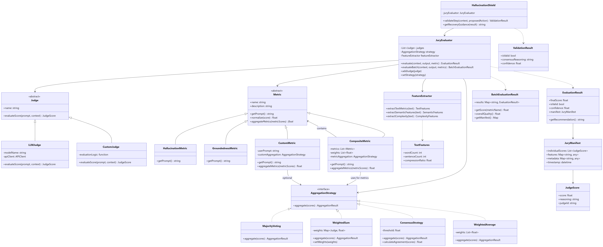

# Architecture

This page provides a high-level overview of LLM Jury's architecture and design principles.

## System Architecture

LLM Jury follows a modular, extensible design that separates concerns:

```
┌────────────────────────────────────────────────┐
│         Application Layer                      │
│  (Your RAG system, agent, or application)      │
└───────────────────┬────────────────────────────┘
                    │
┌───────────────────▼────────────────────────────┐
│         LLM Jury Core                          │
│                                                │
│   ┌──────────────────────────────────────┐     │
│   │     JuryEvaluator                    │     │
│   │  • Orchestrates evaluation           │     │
│   │  • Manages parallel execution        │     │
│   │  • Generates manifests               │     │
│   └──────────────────────────────────────┘     │
│                                                │
│    ┌─────────────┐  ┌──────────┐  ┌──────────┐ │
│    │   Judges    │  │ Metrics  │  │Strategy  │ │
│    │ • LLMJudge  │  │ • Ground │  │ • Voting │ │
│    │ • Custom    │  │ • Halluc │  │ • Weight │ │
│    └─────────────┘  └──────────┘  └──────────┘ │
│                                                │
│   ┌──────────────────────────────────────┐     │
│   │     Feature Extractor                │     │
│   │  • Text metrics                      │     │
│   │  • Complexity analysis               │     │
│   └──────────────────────────────────────┘     │
└────────────────────────────────────────────────┘
                    │
┌───────────────────▼────────────────────────────┐
│         LangChain Layer                        │
│  • Model integrations (OpenAI, Anthropic, etc) │
│  • Message handling                            │
└────────────────────────────────────────────────┘
```

## Class Diagram

The complete class structure and relationships:



### Key Components

#### Core Module

- **JuryEvaluator**: Main orchestrator that coordinates judges, metrics, and strategies
- **Manifest Classes**: Data structures for audit trails and results

#### Judges Module

- **Judge (Abstract)**: Base interface for all evaluators
- **LLMJudge**: Concrete implementation using LangChain models
- **CustomJudge**: Extensible base for custom logic

#### Metrics Module

- **Metric (Abstract)**: Defines evaluation criteria
- **GroundednessMetric**: Checks source-based support
- **HallucinationMetric**: Detects fabrications
- **CompositeMetric**: Combines multiple metrics

#### Strategies Module

- **AggregationStrategy (Abstract)**: Base for combining scores
- **MajorityVoting**: Democratic consensus
- **WeightedSum**: Importance-weighted aggregation
- **ConsensusStrategy**: Threshold-based agreement
- **WeightedAverage**: Statistical averaging

#### Features Module

- **FeatureExtractor**: Analyzes text properties
- Computes: word count, readability, complexity, entropy

#### Tools Module

- **HallucinationShield**: Validates agentic reasoning steps

## Design Principles

### 1. Modularity

Each component has a single responsibility and can be swapped independently:

```python
# Swap strategies without changing judges or metrics
jury.set_strategy(WeightedSum(weights={"gpt-4": 1.5}))

# Add judges dynamically
jury.add_judge(new_judge)
```

### 2. Extensibility

All major components use abstract base classes:

```python
class CustomMetric(Metric):
    def get_prompt(self, context):
        # Your custom logic

class CustomJudge(Judge):
    def evaluate_score(self, prompt, context):
        # Your custom evaluation
```

### 3. Transparency

Every evaluation generates a complete audit trail:

```python
result.manifest.individual_scores  # Each judge's verdict
result.manifest.features          # Text analysis
result.manifest.metadata          # Strategy details
result.manifest.timestamp         # When it happened
```

### 4. Performance

- **Parallel Execution**: Judges run concurrently via ThreadPoolExecutor
- **Batch Processing**: Evaluate multiple items efficiently
- **Lazy Loading**: Components initialized only when needed

### 5. Type Safety

Strong typing throughout for better IDE support and fewer runtime errors:

```python
from typing import List, Dict, Any
from dataclasses import dataclass

@dataclass
class JudgeScore:
    score: float
    reasoning: str
    judge_id: str
    metrics_metadata: Dict[str, float]
```

## Data Flow

### Single Evaluation

```
1. evaluate(context, output, metric)
   │
2. FeatureExtractor.extract()
   │  └─> {word_count, complexity, ...}
   │
3. Metric.get_prompt(context)
   │  └─> "Rate groundedness 1-5..."
   │
4. Parallel Judge Execution
   │  ├─> Judge1.evaluate_score()  → JudgeScore
   │  ├─> Judge2.evaluate_score()  → JudgeScore
   │  └─> Judge3.evaluate_score()  → JudgeScore
   │
5. Optional Normalization
   │  └─> Convert scores to [0, 1]
   │
6. Strategy.aggregate(scores)
   │  └─> AggregationResult(score, confidence)
   │
7. Build Manifest
   │  └─> JuryManifest(scores, features, metadata)
   │
8. Return EvaluationResult
   └─> final_score, is_valid, confidence, manifest
```

### Batch Evaluation

```
1. evaluate_batch(inputs, metrics)
   │
2. For each input:
   │  └─> For each metric:
   │      └─> evaluate() → EvaluationResult
   │
3. Aggregate all results
   │  └─> BatchEvaluationResult
   │
4. Return batch result
   └─> results: Dict[str, EvaluationResult]
```

## Concurrency Model

LLM Jury uses `concurrent.futures.ThreadPoolExecutor` for parallel judge execution:

```python
with ThreadPoolExecutor(max_workers=len(self.judges)) as executor:
    future_to_judge = {
        executor.submit(judge.evaluate_score, prompt, context): judge
        for judge in self.judges
    }

    for future in as_completed(future_to_judge):
        score = future.result()
        # Process score
```

**Benefits**:

- Minimize latency for API-based judges
- Automatic error handling per judge
- Scales with number of judges

## Error Handling

Robust error management at each layer:

```python
# Judge-level: Individual failures don't crash the jury
try:
    score = judge.evaluate_score(prompt, context)
except Exception as e:
    print(f"Judge {judge.name} failed: {e}")
    # Continue with other judges

# Evaluation-level: Graceful degradation
if not judge_scores:
    return EvaluationResult(
        final_score=0.0,
        is_valid=False,
        confidence=0.0
    )
```

## Extension Points

### Adding Custom Components

1. **Custom Judge**: Inherit from `Judge`
2. **Custom Metric**: Inherit from `Metric`
3. **Custom Strategy**: Inherit from `AggregationStrategy`
4. **Custom Features**: Extend `FeatureExtractor`

### Integration Points

- **LangChain Models**: Any `BaseChatModel` or `BaseLanguageModel`
- **External APIs**: Wrap in `Judge` subclass
- **Storage**: Serialize manifests to JSON/database
- **Monitoring**: Hook into manifest metadata

## Project Structure

```
llm-jury/
├── src/llm_jury/
│   ├── core/              # Orchestration
│   │   ├── evaluator.py   # JuryEvaluator
│   │   └── manifest.py    # Result structures
│   ├── judges/            # Evaluator implementations
│   │   ├── base.py        # Abstract Judge
│   │   └── llm_judge.py   # LangChain integration
│   ├── metrics/           # Evaluation criteria
│   │   ├── base.py        # Abstract Metric
│   │   └── predefined.py  # Standard metrics
│   ├── strategies/        # Aggregation logic
│   │   ├── base.py        # Abstract Strategy
│   │   ├── consensus.py   # Voting strategies
│   │   └── weighted.py    # Mathematical aggregation
│   ├── features/          # Text analysis
│   │   └── extractor.py   # FeatureExtractor
│   └── tools/             # Utilities
│       └── shield.py      # HallucinationShield
└── tests/                 # Comprehensive test suite
```

## Performance Considerations

### Latency

- **Parallel judges**: ~1x judge latency (not N×)
- **API calls**: Dominant factor (100-500ms per judge)
- **Feature extraction**: Negligible (<10ms)

### Throughput

- **Single evaluation**: Limited by slowest judge
- **Batch evaluation**: Sequential (can be parallelized further)
- **Recommended**: Use async for high-volume scenarios

### Cost

- **Model costs**: Primary expense (API calls)
- **Strategy**: Use fewer/cheaper judges for initial filtering
- **Optimization**: Cache evaluations for repeated content

## Next Steps

- Understand [Judges](judges.md) implementation
- Explore [Metrics](metrics.md) design
- Learn about [Strategies](strategies.md) internals
